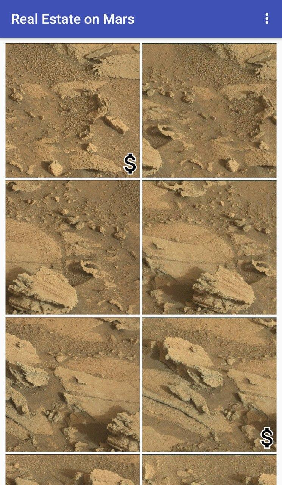
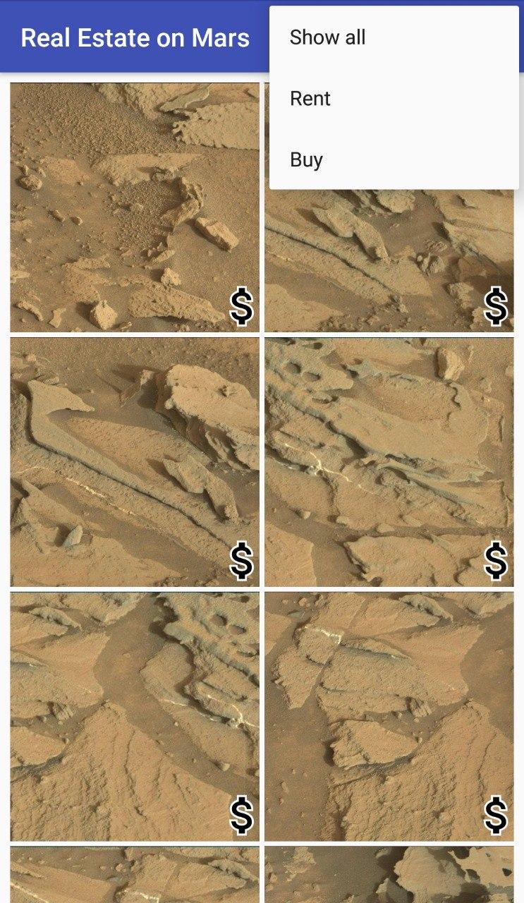
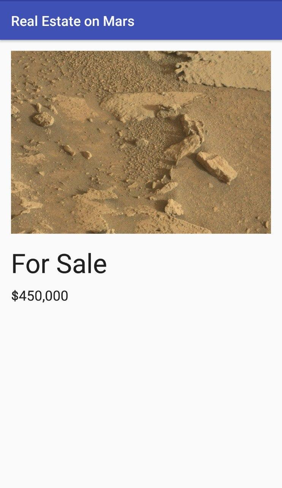
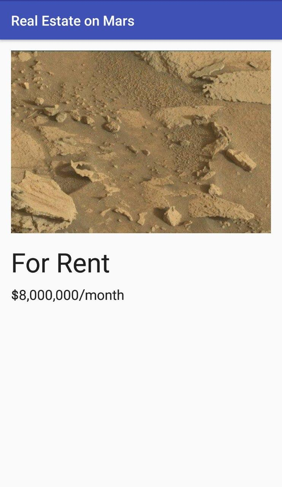

MarsRealEstate
==============================

Project Made During 30 days of Kotlin

Introduction
------------

MarsRealEstate is a app that shows available properties for sale and for rent on Mars.
The property data is stored on a Web server as a REST web service.  
This app demonstrated the use of
This app demonstrates the following views and techniques:
* [Retrofit](https://square.github.io/retrofit/) to make api calls to an HTTP web service
* [Moshi](https://github.com/square/moshi) which handles the deserialization of the returned JSON to Kotlin data objects 
* [Glide](https://bumptech.github.io/glide/) to load and cache images by URL.
 
It leverages the following components from the Jetpack library:

* [ViewModel](https://developer.android.com/topic/libraries/architecture/viewmodel)
* [LiveData](https://developer.android.com/topic/libraries/architecture/livedata)
* [Recycler View](https://developer.android.com/reference/android/support/v7/widget/RecyclerView)
* [Data Binding](https://developer.android.com/topic/libraries/data-binding/) with binding adapters
* [Navigation](https://developer.android.com/topic/libraries/architecture/navigation/) with the SafeArgs plugin for parameter passing between fragments

Explanation Of Concepts used in this project:
------------
* View Model:The overview [ViewModel](https://developer.android.com/topic/libraries/architecture/viewmodel) is responsible for making the network call to get the Mars real estate information. The detail [ViewModel](https://developer.android.com/topic/libraries/architecture/viewmodel) holds details for the single piece of Mars real estate that's displayed in the detail fragment. 

* Live Data: For each [ViewModel](https://developer.android.com/topic/libraries/architecture/viewmodel), you use [LiveData](https://developer.android.com/topic/libraries/architecture/livedata) with lifecycle-aware data binding to update the app UI when the data changes.

* Recycler View: App will use the Glide library to load and display the images, and a [Recycler View](https://developer.android.com/reference/android/support/v7/widget/RecyclerView) to create the grid layout for the images

* Data Binding: The [Data Binding](https://developer.android.com/topic/libraries/data-binding/) Library is a support library that allows you to bind UI components in your layouts to data sources in your app using a declarative format rather than programmatically.

* Navigation: App uses the [Navigation](https://developer.android.com/topic/libraries/architecture/navigation/) component to navigate between the two fragments, and to pass the selected property as an argument.

Screenshots
---------------

Getting Started
---------------

1. Download and run the app.

License
-------

Copyright 2019 Google, Inc.

Licensed to the Apache Software Foundation (ASF) under one or more contributor
license agreements.  See the NOTICE file distributed with this work for
additional information regarding copyright ownership.  The ASF licenses this
file to you under the Apache License, Version 2.0 (the "License"); you may not
use this file except in compliance with the License.  You may obtain a copy of
the License at

  http://www.apache.org/licenses/LICENSE-2.0

Unless required by applicable law or agreed to in writing, software
distributed under the License is distributed on an "AS IS" BASIS, WITHOUT
WARRANTIES OR CONDITIONS OF ANY KIND, either express or implied.  See the
License for the specific language governing permissions and limitations under
the License.
